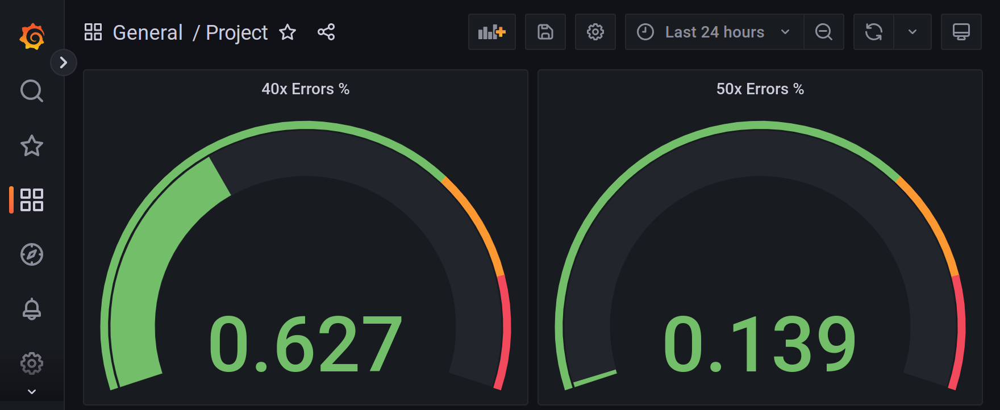

# Metrics Dashboard

**Note:** All screenshots are stored in the `answer-img` directory.

## Verify the monitoring installation

Screenshots of the running pods and services for all components.

### Pods


### Services


## Setup the Jaeger and Prometheus source

Screenshot of the home page after logging into Grafana.


## Basic Dashboard

Grafana dashboard that shows Prometheus as a source.


## Describe SLO/SLI

Based on an SLO of monthly uptime and request response time, the SLIs can be:

- The percent of requests are returned successfully in a month.
- The time to receive a response from the service while it is up and running.

## Creating SLI metrics

The 5 metrics to measure these SLIs:

1. Throughput: measuring the number of requests can be handled in a specific period.
2. Error Rate: measuring percent of requests that returned with errors in respect to the total number of requests.
3. Uptime: measure the percent of requests that returned without errors in respect to the total number of requests.
4. Availability: measure the time that the system is available.
5. Latency: measure percent of responses below the latency threshold.

## Create a Dashboard to measure our SLIs

A dashboard to measure the uptime of the frontend and backend services, and and also to measure 40x and 50x errors.

### The uptime of the frontend and backend services


### 40x and 50x Errors



## Tracing our Flask App

Jaeger UI spans to measure the processes on the backend.


```Python
# reference-app/backend/app.py

#...

def init_jaeger_tracer(service_name='backend_service'):
    logging.getLogger('').handlers = []
    logging.basicConfig(format='%(message)s', level=logging.DEBUG)

    config = Config(config={
        'sampler': {
            'type': 'const',
            'param': 1,
        },
        'logging': True,
    },
        service_name=service_name,
        validate=True
    )
    return config.initialize_tracer()

tracer = init_jaeger_tracer()

mongo = PyMongo(app)
metrics = PrometheusMetrics(app, group_by='endpoint')


@app.route("/")
def homepage():
    with tracer.start_span('HomePage') as span:
        message = "Hello World"
        span.set_tag('message', message)
        return (message)

# ...
```

## Jaeger in Dashboards

Now that the trace is running. The metric to the current Grafana dashboard.


## Report Error

A trouble ticket for the developers, to explain the errors (400, 500, latency) and to let them know the file that is causing the issue.

TROUBLE TICKET

Name:\
backend_service: /star endpoint error

Date:\
2022-11-2020

Subject:\
/star endpoint throw 500 error on POST request

Affected Area:\
file: "reference-app/backend/app.py"

Severity:\
Critical

Description:\
Database wrong configuration leads to critical error while triggering a POST request on /star endpoint.

A screenshot of the tracer span:


## Creating SLIs and SLOs

An SLO guaranteeing that our application has a 99.95% uptime per month. Four SLIs to measure the success of this SLO:

- Uptime >= 99.95% during the last month
- Low latency of request response.
- Low error rate during the last month.
- CPU and Memory moderate consumption.

## Building KPIs for our plan

A list of KPIs to accurately measure these metrics as well as a description of why those KPIs were chosen.

- Uptime for backend and frontend services should be more than or equal 99.95%. The higher is better for availability.
- Reduce the runtime errors for backend and frontend services containers.
- Decrease requests' response time to 300 ms.
- Response time for successful requests should be less than 100 ms.
- Reduce the error rate, the number of errors for HTTP requests. The lower is better.
- Fix all bugs that leads to server errors (status code = 500).
- CPU usage: the amount of CPU resource used by the application must not exceed the moderate usage (~80%-90%) for saturation.
- Memory usage: the amount of Memory resources used by the application must not exceed the moderate (~80%-90%) usage for saturation.

## Final Dashboard

A Dashboard containing graphs that capture all the metrics of the KPIs and adequately representing the SLIs and SLOs.


- Uptime for the backend service is about 99.9%.
- Uptime for the frontend service is about 99.9%.
- Low error rate, about 0.14%.
- Moderate CPU usage for all services. About 17% in total.
- Moderate Memory Usage for all services. About 20% in total.
- Low average requests' response time, about 300ms.
